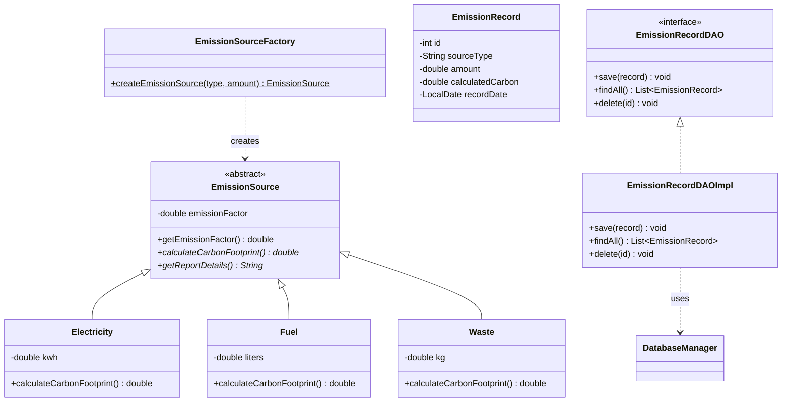
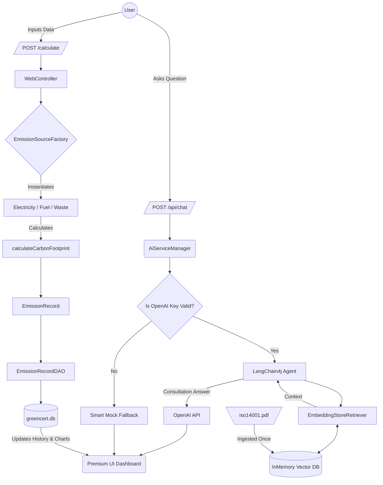

# 🌍 GreenCert Analytics - Enterprise Carbon Management System

GreenCert is a professional **Object-Oriented** enterprise solution designed to track, analyze, and offset corporate carbon footprints while adhering strictly to **ISO 14001** standards. This platform replaces procedural legacy systems with a robust, modern Java architecture.

## 🚀 Key Features
- **Object-Oriented Design**: Built entirely following OOP and SOLID principles (Encapsulation, Polymorphism, Abstraction).
- **SQLite Persistence**: Full CRUD lifecycle (Create, Read, Delete) for emission tracking.
- **AI RAG Consultant**: Integrates a LangChain4j AI agent equipped with Retrieval-Augmented Generation (RAG) to dynamically answer questions based on the `iso14001.pdf` documentation.
- **Premium Glassmorphism UI**: High-end user interface utilizing Chart.js for real-time visual analytics.
- **Smart Fallback Tiers**: If OpenAI APIs are unavailable, the system safely falls back to a smart heuristic Mock Consultant.

---

## 🏗️ Architecture & Technical Documentation

### 1. Object-Oriented Domain (UML Class Diagram)

The core domain employs the **Factory Pattern** and **Polymorphism** to abstract emission calculations.



### 2. System Flow (Logic Diagram)

The application handles dual flows: traditional transactional data processing and AI RAG knowledge retrieval.



---

## ⚙️ Setup and Installation Guide

### Prerequisites
- **Java 17 or higher** (JDK 21 Recommended).
- **Apache Maven**.
- **OpenAI API Key** (Optional, will use Mock Mode if missing).

### Execution Steps
1. Clone the repository and navigate to the project root.
2. Unzip dependencies if required or let Maven resolve them.
3. Configure your API key exclusively in your terminal (do not hardcode it!):
   ```bash
   # Windows (PowerShell)
   $env:OPENAI_API_KEY="your-key-here"
   
   # Linux/Mac
   export OPENAI_API_KEY="your-key-here"
   ```
4. Build and Run the Spring Boot embedded container:
   ```bash
   mvn spring-boot:run
   ```
5. Open your browser and navigate to Application URL: **[http://localhost:8080](http://localhost:8080)**

---
*Developed under strict OOP patterns and ISO 14001 structural principles for academic and professional excellence.*
