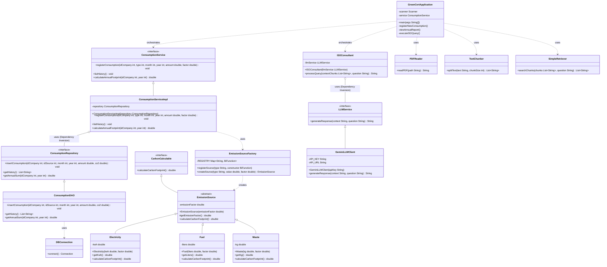

# UML Class Diagram

This diagram displays the complete Object-Oriented structure of the GreenCert project using Java standards. It illustrates all attributes, methods, visibility levels, inheritance, interfaces, and SOLID principle applications.

