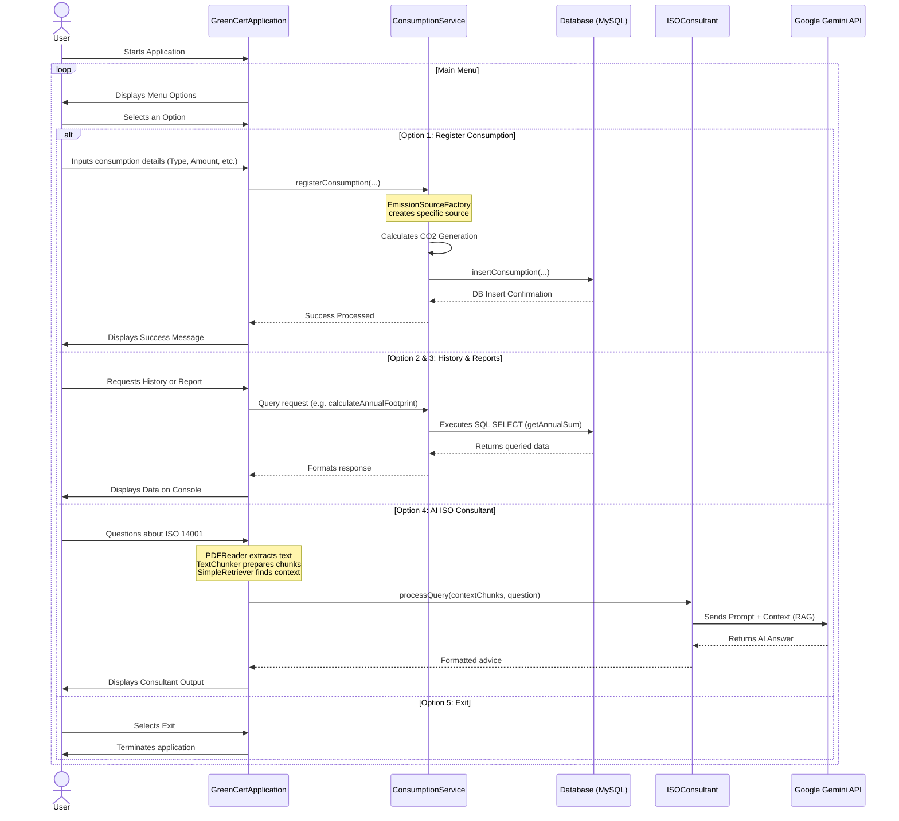

# Sequence and Logic Flow Diagram

This diagram displays the logical sequence of processes between the User, the Application, the Database, and the AI components. This format (Sequence Diagram) represents the interactions much more clearly than a standard flowchart.

