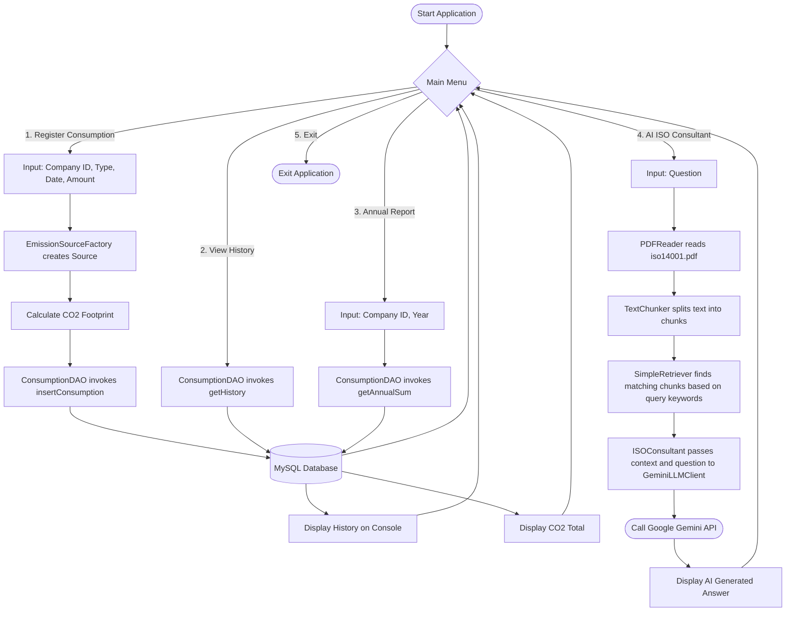

# Activity and Flow Diagram

This diagram represents the logical flow of the main processes within the GreenCert console application, including consumption registration, database queries, and the AI Consulting logic.

